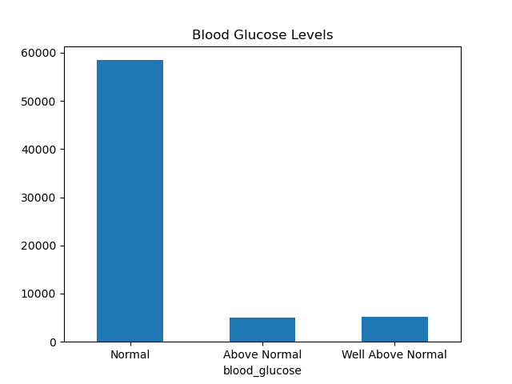
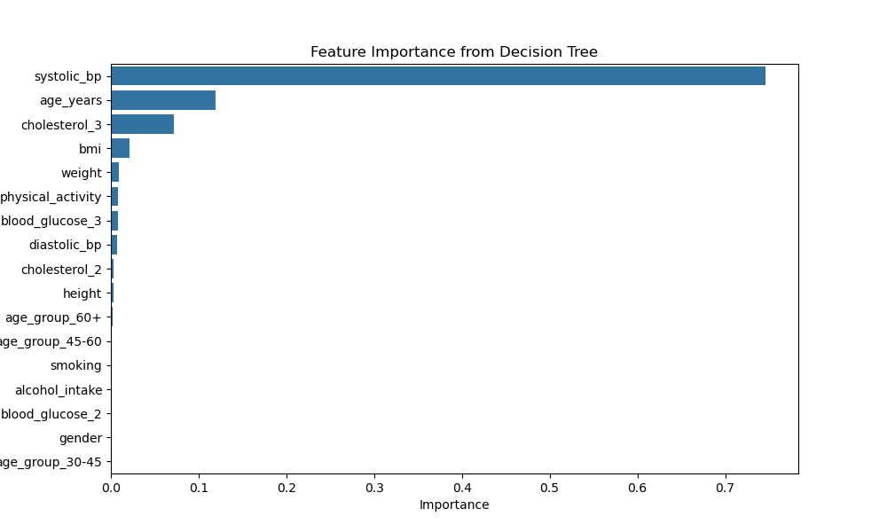
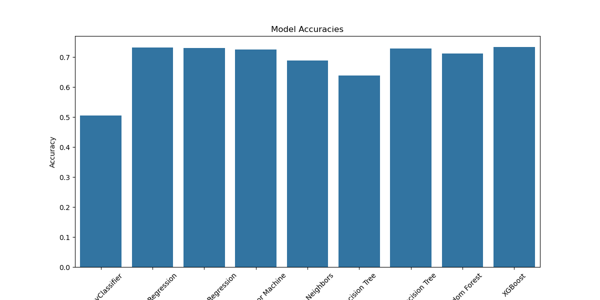

# Capstone Project — Cardiovascular Disease Risk Prediction

This repository contains the UC Berkeley AI/ML Capstone project (2025), which explores predicting cardiovascular disease risk from patient clinical and lifestyle features using classical machine learning models.

## Notebook

The full exploratory analysis, feature engineering, modeling, and evaluation are in the Jupyter notebook: `aiml-capstone.ipynb`.

## Project overview

- Goal: Predict whether a patient is at risk of cardiovascular disease (binary classification) using attributes such as age, height, weight, blood pressure, cholesterol, glucose, smoking, alcohol intake, and physical activity.
- Dataset: `data/cardio_train.csv` (original dataset provided alongside the notebook).

## Dataset fields (as used)
- id: unique patient identifier (dropped prior to modeling)
- age: converted from days to `age_years` (integer)
- height (cm)
- weight (kg)
- gender (categorical code)
- systolic_bp (ap_hi)
- diastolic_bp (ap_lo)
- cholesterol (1=normal, 2=above normal, 3=well above normal)
- blood_glucose (gluc: 1=normal, 2=above normal, 3=well above normal)
- smoking (binary)
- alcohol_intake (alco, binary)
- physical_activity (active, binary)
- cardio_disease (target; 0/1)

## Data cleaning & preprocessing (summary)
- Removed rows with non-positive or inconsistent blood pressure values and ensured systolic >= diastolic.
- Filtered out unrealistic heights and weights (height between 50 and 250 cm; weight between 20 and 300 kg).
- Converted age from days to years (`age_years`).
- Dropped duplicate rows and the `id` column.
- Renamed columns for clarity: `age`→`age_years`, `ap_hi`→`systolic_bp`, `ap_lo`→`diastolic_bp`, `gluc`→`blood_glucose`, `alco`→`alcohol_intake`, `smoke`→`smoking`, `active`→`physical_activity`, `cardio`→`cardio_disease`.

## Feature engineering
- BMI computed as weight / (height/100)^2 and added as `bmi`.
- Age groups created and one-hot encoded: `<30`, `30-45`, `45-60`, `60+`.
- One-hot encoding applied to `cholesterol`, `blood_glucose`, and `age_group` (with `drop_first=True`).

## Modeling
- Train/test split: stratified 80/20 split (`random_state=42`).
- Models trained and evaluated in the notebook include Logistic Regression (example run shown), with helper utilities to compute training time and metrics (Accuracy, Precision, Recall, F5 score) and display confusion matrices.
- Additional classifiers imported and available for experiments: SVM (`SVC`), K-Nearest Neighbors (`KNeighborsClassifier`), Decision Tree (`DecisionTreeClassifier`). Grid search (`GridSearchCV`) utilities are included for hyperparameter tuning.

## Evaluation metrics reported
- Accuracy
- Precision
- Recall
- F5 score (beta=5 — emphasizes recall) - It puts 25 times more importance on recall than precision.
- Confusion matrix visualization

## Files in this repo
- `aiml-capstone.ipynb` — full analysis and code
- `data/cardio_train.csv` — dataset used
- `data/cardio_train.xlsx` — alternate dataset format
## Visualizations (generated by the notebook)

The notebook saves several figures to `images/`. Key charts generated by the notebook are embedded below:

### Age distribution

### Cholesterol levels

### Blood glucose levels

### Correlation matrix

### Systolic vs Diastolic blood pressure

### Box plots of numerical features by target

### Feature importance (Tuned Decision Tree)

### Feature importance (Random Forest)

### Model comparison — F5 scores

### Model comparison — Accuracies

## Results & Conclusion (notebook run summary)

- The Dummy Classifier provided a baseline accuracy of 0.5000, indicating that all models performed better than random guessing.
- The notebook evaluates multiple classifiers and hyperparameter-tuned models. In the latest run (which added Random Forest and XGBoost and used a custom F5 scorer to prioritize recall), the Random Forest Classifier was the best model with an F5 Score of approximately 0.6944.
- The cleaned and processed dataset was saved to `data/cleaned_cardio_data.csv`.
- Key findings:
  - Age, BMI (weight/height^2), and elevated systolic/diastolic blood pressure were among the strongest predictors.
  - Higher cholesterol and blood glucose levels are associated with increased risk.
  - Lifestyle variables (smoking, alcohol intake, physical activity) contributed to risk but had smaller effect sizes compared to clinical measurements.
  - Tuned Logistic Regression and XGBoost showed improvements over baseline in various metrics; full comparisons are in the `images/` charts.

## Recommended next steps (actionable roadmap)

1) Data quality
  - Verify and document all data cleaning rules (e.g., exact thresholds for `systolic_bp`, `diastolic_bp`, height and weight). Add automated checks and unit tests for those rules.
  
2) Feature engineering
  - Add more clinically meaningful features (pulse pressure = systolic - diastolic, categorical BMI bands, interaction terms like age*bmi).
  
3) Modeling 
  - Run systematic experiments across models (Logistic Regression, SVM, KNN, Decision Tree, RandomForest, XGBoost, LightGBM) using `GridSearchCV` or `RandomizedSearchCV` with a custom F5 scorer.
  
4) Evaluation 
  - If dataset is imbalanced, add techniques like class weights, focal loss, or resampling (SMOTE) and evaluate stability.
  
5) Deployment 
  - Create a minimal prediction API (FastAPI or Flask) and a simple web demo or notebook to show single-case predictions and feature attributions.
 
## Contact and Further Information

Feel free to contact me at hitesh.hotlani@gmail.com with any questions or comments.

